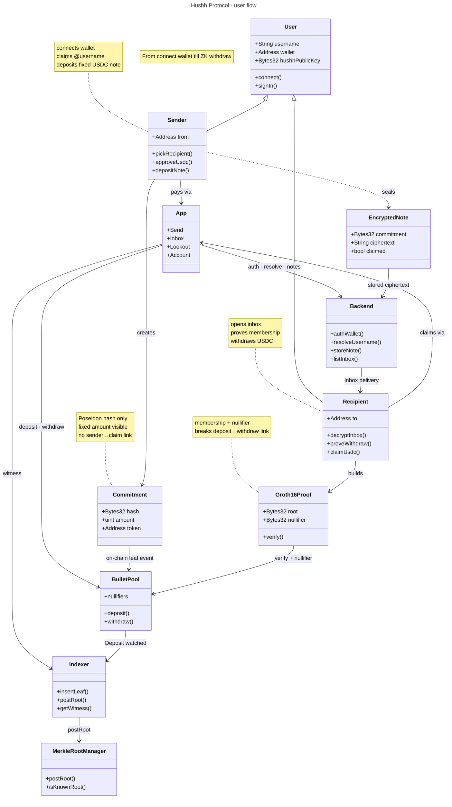

# Hushh Protocol

ZK-private payment rail on **Arc Testnet** (EVM). Send USDC without leaving an on-chain link between deposit and withdraw.

Tagline: send silently.

### Live

| Service | URL |
|---------|-----|
| **App** | [https://hushh-inky.vercel.app](https://hushh-inky.vercel.app) |
| **Backend** | [https://hush-protocol-backend-w7qx.onrender.com](https://hush-protocol-backend-w7qx.onrender.com) |
| **Indexer** | [https://hush-protocol-indexer-iqcg.onrender.com](https://hush-protocol-indexer-iqcg.onrender.com) |
| **Explorer** | [https://testnet.arcscan.app](https://testnet.arcscan.app) |
| **RPC** | `https://rpc.testnet.arc.network` (chain id `5042002`) |

---

## User flow

Domain model for a silent USDC payment: who acts, what is stored, and what never links on-chain.



Nothing on-chain links the sender's deposit transaction to the recipient's withdraw.

---

## Problem

Public blockchains leave a visible trail. Every transfer creates a `sender → recipient` edge anyone can follow. That makes salary, donations, remittances, and contractor payments uncomfortable when the relationship itself should stay private.

## What Hushh Protocol is

Hushh Protocol is a **shielded note pool**:

1. Sender deposits a fixed-size ERC-20 note under a Poseidon commitment.
2. An off-chain indexer inserts the commitment into a Merkle tree and posts the root on-chain.
3. Recipient withdraws with a Groth16 proof of membership. The nullifier prevents double-spend.
4. Nothing on-chain connects the deposit transaction to the withdraw transaction.

Privacy model (v1, stated plainly):

- **Unlinkability** of deposit ↔ withdraw (Tornado-style membership + nullifier).
- **Fixed denominations** for amount-matching resistance. Amounts are standardized, not encrypted.
- **Not** a full shielded pool with hidden balances. That is future work.
- Merkle roots are posted by a relayer (Option B). Decentralizing the indexer is future work.

## Network

| Setting | Value |
|---------|--------|
| Network | Arc Testnet |
| Chain ID | `5042002` |
| Currency | USDC |
| RPC | `https://rpc.testnet.arc.network` |
| Explorer | [testnet.arcscan.app](https://testnet.arcscan.app) |

## Architecture

```
Contracts (Solidity)
      ↓
ZK Circuit (Circom / BN254 Groth16)
      ↓
Proof SDK (TypeScript)
      ↓
Indexer (Merkle tree + postRoot + witness API)
      ↓
Backend (auth, usernames, encrypted notes)
      ↓
Frontend
```

| Component | Responsibility |
|-----------|----------------|
| **Smart contracts** | Hold funds, verify proofs, track nullifiers, accept roots |
| **Indexer** | Watch deposits, build Poseidon Merkle tree, post roots, serve witnesses |
| **SDK** | Secrets, commitments, nullifiers, Merkle proofs, Groth16 proving |
| **Backend** | Wallet auth, `@username` → wallet + Bullet key, encrypted inbox |
| **Frontend** | Deposit / withdraw UX, calls SDK + backend + contracts |

### Contracts

```
BulletPool.sol           deposit / withdraw, nullifiers, embedded token registry
MerkleRootManager.sol    rolling window of 64 valid roots
WithdrawVerifier.sol     Groth16 verifier (replaces mock after zk:build)
MockUSDC.sol             test ERC-20
```

### ZK circuit

Only **withdraw** needs a circuit. Deposit is commitment + ERC-20 transfer + event.

```
nullifier  = Poseidon([secret])
commitment = Poseidon([secret, recipientDigest, amount, tokenHash])
```

Public inputs (locked): `[root, nullifier, recipientDigest, amount, tokenHash]`

`tokenHash = uint256(uint160(tokenAddress))`

### Honest privacy limits

- Fixed denominations, not encrypted balances.
- Anonymity scales with pool size. Demo volume is thin.
- Root posting is permissioned (indexer / relayer).
- Trusted setup is single-contributor until an MPC ceremony.
- Off-chain delivery (claim links, email) can leak metadata; on-chain unlinkability still holds.

---

## Repo layout

Active stack lives in `arc-contracts/`:

```
bullet/
├── frontend/          Next.js app (self-contained; types in src/shared/)
└── arc-contracts/
    ├── contracts/     Solidity (Hardhat)
    ├── zk/            Circom withdraw circuit + snarkjs
    ├── sdk/           Proof SDK (@bullet/sdk)
    ├── indexer/       Deposit watcher + witness API
    ├── backend/       Wallet auth, usernames, encrypted notes
    ├── scripts/       Deploy, token ops, status
    ├── test/          Hardhat tests
    └── deployments/   Per-network addresses
```

Legacy Stellar/Soroban packages (`contracts/`, `circuits/`, root `backend/`) are not the current target. Development continues on Arc + Solidity.

---

## Quick start

Requirements: Node 22+, pnpm 9+, Circom (for circuit builds), Postgres (for indexer).

```bash
cd arc-contracts
pnpm install --ignore-workspace
cp .env.example .env          # set PRIVATE_KEY
pnpm test
```

### Build ZK + SDK

```bash
# Circom: cargo install --git https://github.com/iden3/circom.git circom --locked
pnpm zk:install && pnpm zk:build
pnpm sdk:install && pnpm sdk:build && pnpm sdk:test
```

### Deploy to Arc Testnet

```bash
pnpm deploy          # Arc Testnet (needs PRIVATE_KEY in .env)
pnpm status
```

Writes `deployments/arcTestnet.json` (pool, root manager, verifier, MockUSDC).

| Contract | Address |
|----------|---------|
| BulletPool | `0x9E65584C6ACE76cEFde4FD5f50E6bB9763999dCe` |
| MerkleRootManager | `0x6D6530A1fC908792DA2aa533a5F299283E6F062a` |
| BulletVerifier | `0x0A95c430Bf6AA3140A4Bf04C8D5982472331008d` |
| MockUSDC | `0x7d7aF5715e5671e0E3126b2428Dc2629bD9061e3` |

### Indexer

```bash
pnpm indexer:install
cp indexer/.env.example indexer/.env
# BULLET_POOL_ADDRESS, MERKLE_ROOT_MANAGER_ADDRESS, RELAYER_PRIVATE_KEY
# DATABASE_URL=mongodb+srv://…/hushh_indexer
# RPC_URL=https://rpc.testnet.arc.network  CHAIN_ID=5042002

pnpm indexer:migrate
pnpm indexer:dev                 # API :4010
```

Witness API: `GET /witness/:commitment` (no secrets returned).

### Backend

```bash
pnpm backend:install
# MONGODB_URI=mongodb+srv://…/hushh
pnpm backend:db
pnpm backend:dev                 # API :4020
```

Auth / resolve / inbox only. No proving. No Merkle. No chain calls.

### Frontend env

```bash
cp frontend/.env.example frontend/.env
# addresses already filled from deployments/arcTestnet.json
# Local:
# NEXT_PUBLIC_FRONTEND_URL=http://localhost:3000
# NEXT_PUBLIC_BACKEND_URL=http://127.0.0.1:4020
# NEXT_PUBLIC_INDEXER_URL=http://127.0.0.1:4010
# Hosted:
# NEXT_PUBLIC_FRONTEND_URL=https://hushh-inky.vercel.app
# NEXT_PUBLIC_BACKEND_URL=https://hush-protocol-backend-w7qx.onrender.com
# NEXT_PUBLIC_INDEXER_URL=https://hush-protocol-indexer-iqcg.onrender.com
```

---

## Protocol flow

```
Deposit
  SDK: secret → commitment + encrypt note to recipient bulletPublicKey
  BulletPool.deposit(token, amount, commitment)
  Indexer: insert leaf → postRoot
  Backend: POST /notes (ciphertext only)

Withdraw
  Backend: GET /notes → decrypt locally
  Indexer: GET /witness/:commitment
  SDK: generateProof(note, merklePath)
  BulletPool.withdraw(proof, root, nullifier, recipientDigest, recipient, token, amount)
  Backend: PATCH /notes/:id/claim
```

### SDK usage

```ts
import {
  createNote,
  MerkleTree,
  generateProof,
  encodeProof,
  tokenHash,
} from "@bullet/sdk";

const note = await createNote({
  recipientDigest,
  amount: 10_000_000n, // 10 USDC (6 decimals)
  token: usdcAddress,
});
// deposit(note.commitmentBytes32) …
// later: generateProof(note, witness, { wasmPath, zkeyPath })
```

Frontend should call the SDK. Never reimplement Poseidon / proving in the app.

---

## Scripts (`arc-contracts`)

| Command | Purpose |
|---------|---------|
| `pnpm test` | Hardhat contract tests |
| `pnpm deploy` | Full stack deploy to Arc Testnet |
| `pnpm deploy:token` | Deploy / register MockUSDC on Arc |
| `pnpm add:token` / `remove:token` | Token registry |
| `pnpm mint:token` | Mint MockUSDC |
| `pnpm post:root` | Manual root post |
| `pnpm status` | Print deployment file + on-chain status |
| `pnpm zk:build` | Circuit → zkey → Verifier.sol |
| `pnpm indexer:dev` | Run indexer API |

---
# HushProtcol
